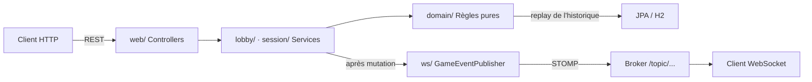
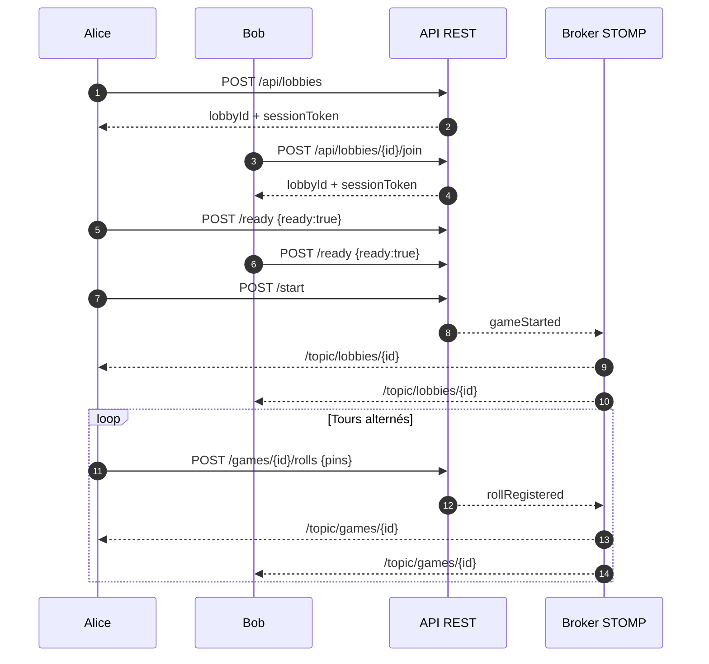

# Telemis Throw Back

Backend d'un jeu de **bowling multijoueur en ligne** : création de salons (lobbies), tours de jeu alternés et diffusion d'événements en temps réel via WebSocket STOMP.

> Variante de bowling maison : **15 quilles par frame**, **5 frames**, **3 lancers de base** (4 dans la dernière frame), score parfait à **300**.

---

## Fonctionnalités

-  **Lobbies** : créer, rejoindre, quitter un salon ; marquage « prêt » ; démarrage de la partie par l'hôte uniquement
-  **Parties multijoueurs** : tours alternés, validation des lancers côté domaine, détection de fin de partie
-  **Temps réel** : diffusion des états (salon + partie) sur un broker STOMP en lecture seule après chaque mutation REST
-  **Identité par jeton** : pas d'authentification classique — un `X-Session-Token` (UUID) est remis à chaque membre lors de la création ou de la jointure d'un lobby
-  **Règles du jeu isolées** : le domaine (frames, scores, strikes/spares) est purement in-memory et répliqué depuis l'historique persisté des lancers

---

## Stack technique

| Technologie | Version |
|---|---|
| Java | 25 |
| Spring Boot | 4.1.1 |
| Build | Maven (wrappers `mvnw` / `mvnw.cmd`) |
| Persistance | Spring Data JPA + H2 (en mémoire) |
| API | Spring MVC REST + `springdoc-openapi` (Swagger UI) |
| Temps réel | Spring WebSocket / STOMP + SockJS |
| Mapping | MapStruct 1.6.3 + Lombok |
| Validation | Jakarta Bean Validation |
| Tests | JUnit 5, MockMvc, AssertJ |

---

## Règles du jeu (variante « Throw Back »)

Définies dans `domain/GameRules` :

- **15 quilles** par frame (au lieu de 10)
- **5 frames** par partie (au lieu de 10)
- **3 lancers** de base par frame ; la dernière frame en autorise jusqu'à **4**
- **Strike** : vider le rack dès le premier lancer → bonus des 3 lancers suivants
- **Spare** : vider le rack en 2 lancers → bonus des 2 lancers suivants
- **Score parfait** : **300**

Un lancer est rejeté s'il dépasse le nombre de quilles restantes debout, et un lancer hors bornes (0–15) est bloqué dès la validation HTTP.

---

## Architecture



### Flux de jeu



### Packages

| Package | Rôle |
|---|---|
| `domain/` | Règles du jeu pures et immuables : `Game`, `Frame`, `Roll`, `ScoreCalculator`, `GameRules` |
| `lobby/` | Agrégat `Lobby` (membres, statuts, hôte), `LobbyService`, repository JPA |
| `session/` | Agrégat `GameSession` (tours, complétion), `GameSessionService`, `GameLifecycleService` (démarrage depuis un lobby) |
| `web/` | `LobbyController` + `GameController`, DTOs, mapper MapStruct |
| `ws/` | `WebSocketConfig` (broker STOMP), `GameEventPublisher`, enveloppe `StompEvent` |

### Modèle de données

Tables créées par JPA (H2) : `lobbies`, `lobby_members`, `game_sessions`, `player_game_states`, `rolls`.

L'état d'un joueur n'est pas stocké en dur : il est **reconstruit en rejouant l'historique de ses lancers** (`PlayerGameState.toDomainGame()`).

---

## Démarrage rapide

### Prérequis

- **JDK 25** (versions récentes du projet)
- Maven **non requis** : les wrappers `mvnw` / `mvnw.cmd` sont inclus

### Lancer le serveur

```bash
# Linux / macOS
./mvnw spring-boot:run

# Windows
mvnw.cmd spring-boot:run
```

Le serveur démarre sur **`http://localhost:8080`** (port par défaut Spring Boot).

### Outils intégrés

| Outil | URL |
|---|---|
| Swagger UI (springdoc) | `http://localhost:8080/swagger-ui.html` |
| Console H2 | `http://localhost:8080/h2-console` |
| Endpoint STOMP (SockJS) | `ws://localhost:8080/ws` |

---

## API REST

Enveloppe de réponse standard — `ApiResponse<T>` :

```json
{ "success": true, "data": { "...": "..." }, "error": null }
```

En cas d'erreur : `{ "success": false, "data": null, "error": { "code": "...", "message": "..." } }`.

### Lobbies

| Méthode | Route | Corps / En-tête | Réponse |
|---|---|---|---|
| `POST` | `/api/lobbies` | `{ "displayName": "Alice" }` | `201` `LobbyMembershipDto` |
| `GET` | `/api/lobbies/{lobbyId}` | — | `LobbySnapshot` |
| `POST` | `/api/lobbies/{lobbyId}/join` | `{ "displayName": "Bob" }` | `201` `LobbyMembershipDto` |
| `POST` | `/api/lobbies/{lobbyId}/leave` | `X-Session-Token` | `200` |
| `POST` | `/api/lobbies/{lobbyId}/ready` | `X-Session-Token` + `{ "ready": true }` | `LobbySnapshot` |
| `POST` | `/api/lobbies/{lobbyId}/start` | `X-Session-Token` (hôte) | `GameStartedPayload` |

`LobbyMembershipDto` est la **seule réponse qui contient le `sessionToken`** : il est privé au membre concerné et ne figure jamais dans les vues publiques (`LobbySnapshot`).

### Parties

| Méthode | Route | Corps / En-tête | Réponse |
|---|---|---|---|
| `GET` | `/api/games/{gameId}` | — | `GameSessionSnapshot` |
| `GET` | `/api/games/{gameId}/me` | `X-Session-Token` | `MePayload` |
| `POST` | `/api/games/{gameId}/rolls` | `X-Session-Token` + `{ "pins": 7 }` | `RollUpdateEvent` |

> Le jeton de session décide **qui** lance, pas l'URL : le `gameId` ne sert qu'à identifier la partie. Un lancer hors tour est rejeté par le domaine (`NotPlayerTurnException`).

### Exemple de parcours complet

```bash
# 1. Créer un lobby (Alice devient l'hôte et reçoit son jeton)
curl -X POST localhost:8080/api/lobbies \
  -H "Content-Type: application/json" \
  -d '{"displayName":"Alice"}'

# 2. Bob rejoint
curl -X POST localhost:8080/api/lobbies/<lobbyId>/join \
  -H "Content-Type: application/json" \
  -d '{"displayName":"Bob"}'

# 3. Tout le monde se déclare prêt, puis Alice démarre
curl -X POST localhost:8080/api/lobbies/<lobbyId>/ready \
  -H "X-Session-Token: <tokenAlice>" -H "Content-Type: application/json" \
  -d '{"ready":true}'

curl -X POST localhost:8080/api/lobbies/<lobbyId>/start \
  -H "X-Session-Token: <tokenAlice>"

# 4. Le joueur courant lance
curl -X POST localhost:8080/api/games/<gameId>/rolls \
  -H "X-Session-Token: <tokenDuJoueurCourant>" \
  -H "Content-Type: application/json" \
  -d '{"pins":7}'
```

### Codes d'erreur

Codes et statuts HTTP **couverts par les tests API** (`web/GlobalExceptionHandlerApiTest`) :

| Code | Statut HTTP | Signification |
|---|---|---|
| `VALIDATION_ERROR` | `400` | Requête invalide (nom vide, quilles hors bornes…) |
| `INVALID_SESSION_TOKEN` | `401` | Jeton inconnu / étranger au salon ou à la partie |
| `NOT_LOBBY_HOST` | `403` | Seul l'hôte peut démarrer la partie |
| `LOBBY_NOT_FOUND` | `404` | Lobby inexistant |
| `GAME_NOT_FOUND` | `404` | Partie inexistante |
| `LOBBY_NOT_READY` | `409` | Un membre n'est pas prêt au démarrage |
| `GAME_NOT_IN_PROGRESS` | `409` | Lancer alors que la partie est terminée |

Le domaine définit d'autres exceptions métier (`LobbyNotOpenException`, `NotPlayerTurnException`, `ConcurrentRollConflictException`, `PlayerNotInGameException`…) dont le mapping HTTP n'est pas encore figé.

---

## WebSocket (temps réel)

Le broker est **lecture seule** (read-only STOMP) : aucune commande n'est envoyée par WebSocket — les mutations passent par REST, puis l'état est **diffusé** sur les topics.

| Topic | Événements (`type`) | Payload |
|---|---|---|
| `/topic/lobbies/{lobbyId}` | `playerJoined`, `playerLeft`, `playerReadyChanged`, `gameStarted` | `LobbySnapshot` / `GameStartedPayload` |
| `/topic/games/{gameId}` | `rollRegistered` | `RollUpdateEvent` |

Enveloppe commune `StompEvent` :

```json
{
  "type": "rollRegistered",
  "id": "<uuid de la partie>",
  "payload": { "...": "..." },
  "timestamp": "2026-09-17T12:00:00Z"
}
```

---

## Structure du projet

```
src/
├── main/
│   ├── java/com/telemisl/rcher/modules/telemisbowling/
│   │   ├── TelemisBowlingApplication.java      # Point d'entrée Spring Boot
│   │   ├── domain/      # Règles du jeu (Game, Frame, Roll, ScoreCalculator…)
│   │   ├── lobby/       # Lobbies : agrégat, service, repository, exceptions
│   │   ├── session/     # Sessions de jeu : agrégat, services, snapshots
│   │   ├── web/         # Contrôleurs REST, DTOs, mapper MapStruct
│   │   └── ws/          # Config STOMP, GameEventPublisher, StompEvent
│   └── resources/
│       ├── application.properties
│       └── static/models/                      # Assets 3D (GLB/OBJ)
└── test/
    └── java/…                                    # Tests JUnit 5 (13 fichiers)
```

---

## Tests

```bash
./mvnw test
```

Le projet couvre :

- **Domaine** : `FrameTest`, `GameTest` (règles, scores, strikes/spares)
- **Lobby** : `LobbyTest`, `LobbyServiceTest`
- **Session** : `GameSessionTest`, `GameSessionServiceTest`, `GameLifecycleServiceTest`, `GameSessionPersistenceTest` (JPA/H2)
- **Web** : `LobbyAndGameApiTest`, `GlobalExceptionHandlerApiTest` (MockMvc sur la vraie pile MVC)
- **WebSocket** : `GameSessionWebSocketTest`, `GameEventPublisherTest`

---

## Notes

- Les messages d'erreur du domaine sont en français ; les identifiants de code (`LOBBY_NOT_FOUND`, …) sont en anglais.
- Le référentiel ne contient pas encore de client web : les composants REST + WebSocket sont prêts à être consommés par un frontend (les modèles 3D servis en statique suggèrent un rendu three.js à venir).
